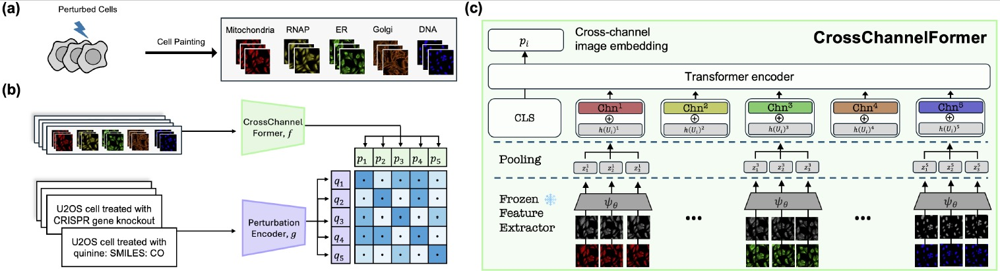

# [CellCLIP - Learning Perturbation Effects in Cell Painting via Text-Guided Contrastive Learning](https://arxiv.org/pdf/2506.06290) (NeurIPS 2025)

This repository provides code and instructions to reproduce the results presented in our work on **CellCLIP**. The proposed framework aligns Cell Painting image embeddings with perturbation-level textual descriptions, enabling biologically meaningful representations for downstream retrieval and matching tasks.

---
By [Mingyu Lu](https://mingyu-lu.github.io/), [Ethan Weinberger](https://ethanweinberger.com/), [Chanwoo Kim](https://chanwoo.kim/), [Su-In Lee](https://aims.cs.washington.edu/su-in-lee)

[](https://arxiv.org/abs/2506.06290)
[](https://huggingface.co/suinleelab/CellCLIP)
[](https://q8888620002.github.io/CellCLIP-website/)



### Update 8/11 - Pretrained CellCLIP (w DINOv2-giant) on Hugging Face

We now provide a pretrained **CellCLIP** model on Hugging Face:[suinleelab/CellCLIP](https://huggingface.co/suinleelab/CellCLIP)

### Usage Example

```python
from huggingface_hub import hf_hub_download
from src.helper import load  # make sure your helper path is correct

ckpt_path = hf_hub_download(
    repo_id="suinleelab/CellCLIP",
    filename="model.safetensors"
)
model = load(
    model_path=ckpt_path,
    device=device,
    model_type="cell_clip",
    input_dim=1536,
    loss_type="cwcl"
)

```

---

### Directory Structure
```plaintext
├── src/                        # Core source files
│   ├── clip/                   # CellCLIP and contrastive learning modules
│   │   ├── method.py           # Contrastive loss implementations (e.g., CWCL, CLOOB, InfoNCE)
│   │   └── model.py            # CellCLIP and CrossChannelFormer model definitions
│   ├── helpler.py              # Utility functions
│   └── ...                     # Other supporting modules
│
├── configs/                    # Model and training configuration files
├── preprocessing/              # Files for preprocessing
│
├── main.py                     # Main training script
│
├── retrieval.py                # Cross-modal retrieval evaluation
├── rxrx3-core_efaar_eval.py    # Intra-modal evaluation on RxRx3-core (gene–gene recovery)
└── cpjump_matching_eval.py     # Replicate detection and sister perturbation matching on CP-JUMP1

```


## Workflow Summary

To reproduce the results, follow these steps:

1. **Environment setup and installation**
2. **Preprocessing Cell Painting images and associated metadata**
3. **Training the proposed model**
4. **Evaluating cross-modal and intra-modal retrieval performance**

## Setup
### 1. Install Required Packages
Set up a virtual environment with Python 3.11.5.
Before starting, ensure all required packages are installed:
```bash
pip install -r requirements.txt
```

### 2. Set up Directory Paths
Create a `src/constants.py` file with the following content:
```bash
DATASET_DIR = "dataset_dir"
OUTDIR = "model_out_dir"
LOGDIR = "log_dir"
```

Add the repo directory to PYTHONPATH:
```bash
export PYTHONPATH="$PYTHONPATH:$PWD"
```

## Dataset Downloading & Preprocessing

Please first download Cell Painting images and corresponding metadata and labels from each link.

### 1. Sources

1. **Bray2017 Preprocessed Data**
   Available at: [https://ml.jku.at/software/cellpainting/dataset/](https://ml.jku.at/software/cellpainting/dataset/)

2. **RxRx3-Core**
   Download from [RxRx3-core at Hugging Face](https://huggingface.co/datasets/recursionpharma/rxrx3-core)

3. **CP-JUMP1**
   Available via instruction from the [official repository](https://github.com/jump-cellpainting/2024_Chandrasekaran_NatureMethods/tree/main)

### 2. Image Preprocessing

To normalize raw Cell Painting image values into the [0-255], use:

```bash
python preprocessing/preprocess_images.py
```
### 3. Feature Extraction (Embedding Generation)

Once the preprocessed images are ready, you can generate embeddings using our proposed CrossChannelFormer encoding scheme by running:

```bash
python preprocessing/convert_npz_to_avg_emb.py \
  --model_card facebook/dino-vitb8 \  # Feature extractor to generate embeddings
  --dataset bray2017 \
  --input_dir path_to_dataset \
  --aggregation_strategy mean \       # Aggregation method (e.g., mean, attention)
  --n_crop 1 \                        # Number of crops per image
  --output_file dino-vitb8_ind.h5     # Output file path

```

### 3. Prompt Generation for Text Descriptions
To generate molecule-level prompts or fingerprints for contrastive training:

 ```bash
 python preprocessing/preprocess_molecules.py \
  --dataset [bray2017 | jumpcp | rxrx3-core] \
  --output_file output_filename.h5|csv \
  --img_dir /path/to/input_data
  ```

## Training a CellCLIP from Scratch
To train CellCLIP, execute the following command:

```bash
python main.py

# === Dataset and Input Files ===
--dataset [bray2017 | jumpcp] \                          # Dataset name
--img_dir /path/to/image_embeddings or images \          # Directory containing image embeddings or images in step2

# === Image Preprocessing (Optional) ===
--image_resolution_train 224 \                           # Resolution of training image inputs
--image_resolution_val 224 \                             # Resolution of validation image inputs

--molecule_path /path/to/perturbation_descriptions \     # Path to molecule or text input in step 2
--unique                                                 # Whether to treat perturbations as unique (multi-instance mode)

# === Model Configuration ===
--model_type [milcellclip | cloome | molphenix] \        # Type of model architecture
--input_dim [768 | 1024 | 1536] \                        # Input feature dimensionality (depends on embedding source)
--loss [cwcl | clip | cloob] \                           # Contrastive loss function

# === Optimization Hyperparameters ===
--epochs 50 \                                            # Number of training epochs
--batch_size 512 \                                       # Batch size

# === Learning Rate and Scheduler ===
--lr 5e-4 \                                              # Learning rate
--lr_scheduler [cosine | const | const-cooldown] \       # LR scheduler type
--warmup 1000 \                                          # Number of warmup steps
--num_cycles 5 \                                         # Number of cosine cycles for LR scheduler

# === Checkpointing & Logging ===
--ckpt_freq 1000 \                                       # Frequency (in steps) to save checkpoints
--keep_all_ckpts \                                       # Save all checkpoints (not just latest)
--log_freq 20 \                                          # Log every N steps
--eval_freq 500                                          # Evaluate every N steps
```

### Multi-GPU Training
To enable distributed training across multiple GPUs, use ```accelerate```:

```bash
accelerate launch --config_file configs/your_config.yaml main.py ...
```
Note: On a setup with 8 × RTX 6000 GPUs, a maximum batch size of 512 has been tested successfully. Below is an example  command to train CellCLIP using ```accelerate```.

```bash
accelerate launch \
  --config_file configs/ddp_config.yaml main.py \
  --split 1 \
  --is_train \
  --resume \
  --batch_size 512 \
  --epochs 50 \
  --model_type mil_cell_clip \
  --input_dim 1536 \
  --dataset bray2017 \
  --img_dir path_to_embeddings \
  --unique \
  --molecule_path path_to_molecules \
  --loss_type cloob \
  --lr_scheduler cosine-restarts \
  --num_cycles 4 \
  --wd 0.1 \
  --init-inv-tau 14.3 \
  --learnable-inv-tau \
  --warmup 1000 \
  --ckpt_freq 500 \
  --eval_freq 100 \
  --opt_seed 42 \
  --lr 0.0001

```

## Evaluation

This section describes how to evaluate the trained model on both **cross-modal** and **intra-modal** tasks.

### 1. Cross-Modal Retrieval (Bray et al., 2017)

Evaluate the alignment between Cell Painting images and perturbation-level text embeddings:

```bash
python retrieval.py \

--embedding_type /path/to/eval_embeddings \              # Path to aggregated embeddings

--model_type [milcellclip | cloome | molphenix] \        # Model architecture
--input_dim [768 | 1024 | 1536] \                        # Embedding dimensionality
--loss [cwcl | clip | cloob] \                           # Loss used during training
--ckpt_path /path/to/trained_model.pt \                  # Path to model checkpoint
--unique \                                               # Use multi-instance mode if applicable

--image_resolution_train 224 \                           # Resolution used for training
--image_resolution_val 224                               # Resolution used for evaluation
```
For models trained on individual instances and evaluated on pooled profiles, use ```retrieval_whole.py```.


### 2. Evaluating CellCLIP in Intra Modal Evaluation
#### a. RxRx3-Core: Gene–Gene Relationship Recovery

Use the following script to generate instance-level embeddings for RxRx3-core evaluation:

```bash
python preprocessing/convert_emb_to_ind_rxrx3core_emb.py \
  --ckpt_path /path/to/trained_model.pt \
  --model_type milcellclip \
  --loss_type cwcl \
  --input_dim 1536 \
  --output_file output_embeddings.npz \
  --img_dir /path/to/test_embeddings
```
Run zero-shot recovery of gene–gene relationships evaluation on RxRx3-Core

```bash
python rxrx3-core_efaar_eval.py --filepath [path_to_precomputed embeddings from a trained model, e.g., CellCLIP]
```

#### b. CP-JUMP1: Replicate Detection & Sister Perturbation Matching
This evaluation tests the model’s ability to:
- Detect biological replicates (same perturbation, different images)
- Match sister perturbations that target the same biological pathway

---
Use the following script to generate instance-level embeddings from a trained model:

```bash
python preprocessing/convert_emb_to_cellclip_emb.py
--ckpt_path [path to trained CellCLIP ckpt]
--model_type [mil_cell_clip]
--loss_type cwcl
--input_dim 1536
--pretrained_emb name of the pretrained embeddings

--img_dir path_to_testing_data_embeddings
```

Run CP-JUMP1 Evaluation

```bash
python cpjump1_matching_eval.py \

--kernel poly \                                           # Kernel for batch correction (e.g., poly)
--feature_type [profile | emb] \                          # Whether to use raw profiles or embeddings
--batch_correction                                        # Enable batch effect correction

```
